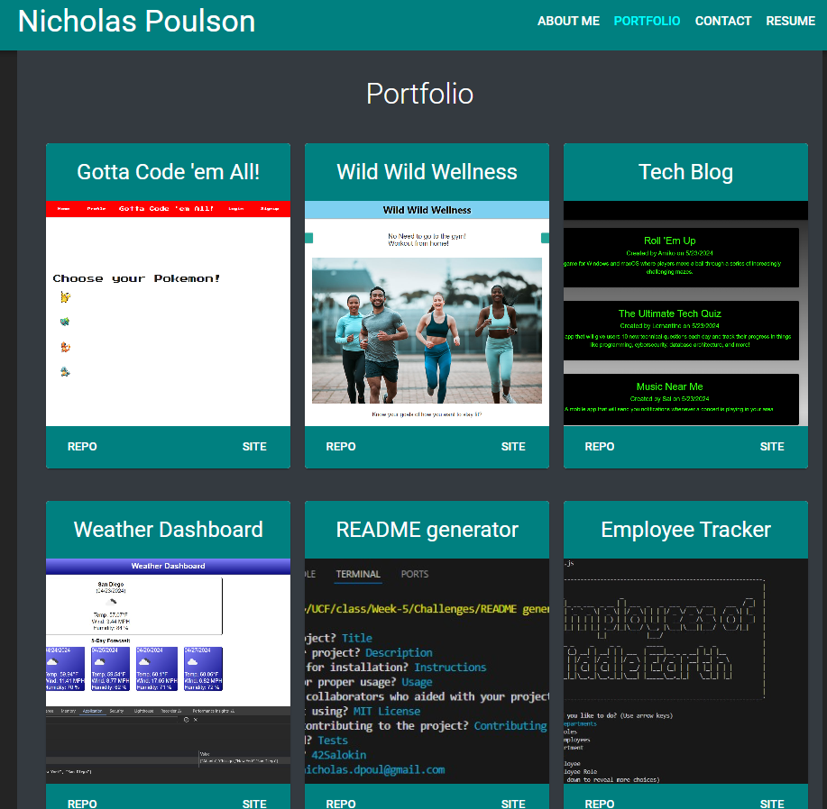

# React Portfolio
 ## Description
  

  This application is a portfolio using React and Javascript to showcase my projects. The nav links will take the user between the four pages. On the portfolio page, they can view samples of my projects, and go to the repos, deployed sites, or demo videos for more details. On the contact page, they can send me a message. On the resume page, they can view my profiencies, or click a link to be taken to a downloadable copy of my resume. In the footer, they can click the icons to go to my GitHub, LinkedIn profile, or Indeed resume. 

  Live site deployed to Netlify at:  https://salokinreactportfolio.netlify.app/

  ## Table of Contents

  * [Installation](#installation)
  * [Usage](#usage)
  * [Credits](#credits)
  * [License](#license)
  * [Contributing](#contributing)
  * [Tests](#tests)
  * [Questions](#questions)

  ## Installation

N/A

  ## Usage

See description

  ## Credits

  I would like to thank my classmates, TAs, and tutors in the UCF Bootcamp for their advice and access to resources. 

  ## License

  
  This project is licensed under the MIT License.

  [License: MIT](https://opensource.org/licenses/MIT)

  ## Contributing

  If you would like to make any contributions, please make any changes in a branch and submit a pull request with detailed comments.

  ## Tests

  See Usage 

  ## Questions

  For more information, see my [GitHub](https://github.com/42Salokin)

  Send any questions or comments to nicholas.dpoul@gmail.com
